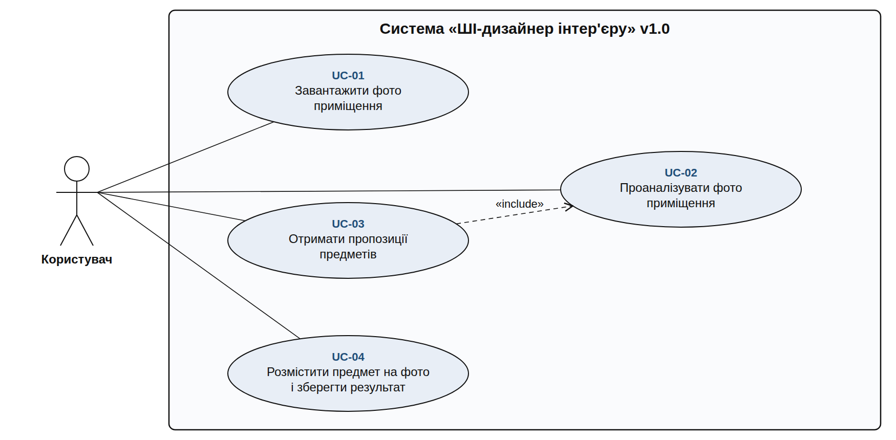
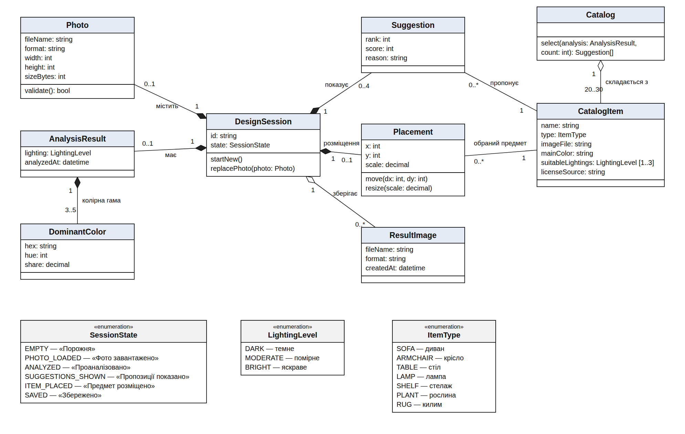
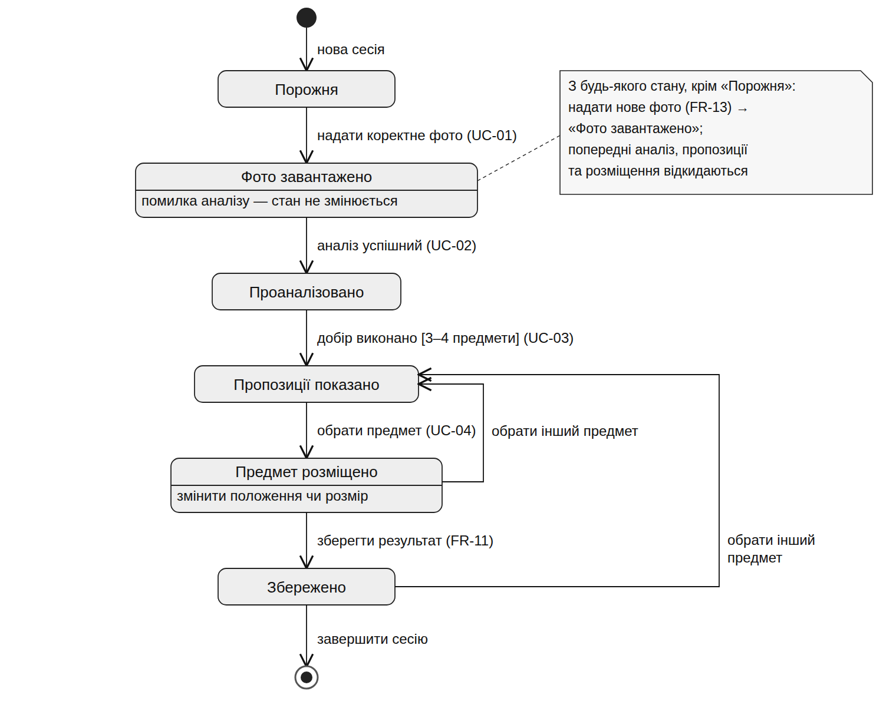

# Проєктування v1.0

Сторінка пояснює UML-моделі першої версії. Редаговані джерела діаграм лежать у каталозі [`model/`](../model/), готові зображення — у [`docs/images/`](images/). Вимоги: [requirements.md](requirements.md), простежуваність: [traceability.md](traceability.md).

## 1. Діаграма варіантів використання

**Інженерне питання:** хто взаємодіє із системою і для чого.
**Що видно:** один актор (Користувач) і чотири цілі, які покривають завершений сценарій v1.0. UC-03 включає UC-02 (без аналізу добір неможливий), Порядок UC-01 → UC-02 → UC-03 → UC-04 задають передумови у специфікаціях (у діаграмі не показано, як у прикладі команди).
**Вимоги:** FR-01…FR-13 (відповідність — у [use-cases.md](use-cases.md)).

## 2. Діаграма класів

**Інженерне питання:** які предметні сутності, атрибути й зв'язки потрібні для v1.0.
**Що видно:** сесія користувача (`DesignSession`) складається з фото, результату аналізу (3–5 домінантних кольорів і рівень освітленості), 3–4 пропозицій та розміщення предмета. Каталог складається з 20–30 позицій; пропозиція й розміщення посилаються на позицію каталогу. Технічні класи (контролери, DTO) не моделюються.
**Вимоги:** FR-01, FR-03…FR-12, NFR-04, NFR-05, NFR-06.

Кратності відповідають вимогам: `3..5` кольорів (FR-03), `0..4` пропозиції (FR-06), `20..30` позицій каталогу (FR-12).

## 3. Діаграма станів (State Machine)

**Інженерне питання:** які стани має сесія й які переходи дозволені.
**Чому потрібна:** поведінка залежить від стану — не можна добирати предмети до аналізу, розміщувати до вибору, зберігати до розміщення (FR-06, FR-08, FR-11); заміна фото повертає сесію до `PHOTO_LOADED` (FR-13); під час аналізу заміна фото заблокована.
**Що видно:** шість станів, основний шлях `EMPTY → … → SAVED`, повернення для іншого предмета (FR-10) та для нового фото (FR-13).
**Вимоги:** FR-01, FR-06, FR-08…FR-11, FR-13.

## 4. Activity Diagram

Індивідуальні Activity Diagram зберігаються як Mermaid у Markdown, по одній на Use Case: [UC-01](../model/activity-uc-01.md), [UC-02](../model/activity-uc-02.md), [UC-03](../model/activity-uc-03.md), [UC-04](../model/activity-uc-04.md). Зображення для звіту: `images/activity-uc-0X.png`.

## 5. Sequence Diagram

У ЛР №3 не будується: технічні учасники ще не визначені, діаграма перетворилася б на припущення. Створюється в ЛР №4 за фактичним кодом.

## 6. Основні проєктні рішення

- Виділено одного актора, бо права в v1.0 однакові.
- Модель тримає стан у `DesignSession`, тому дозволені переходи перевіряються в одному місці.
- Правила добору (R1–R4) вилучено з класів у SRS, щоб їх можна було калібрувати без зміни моделі.
- Те, що не входить до v1.0 (AR, генерування зображень, кілька предметів, облікові записи), не моделюється.
