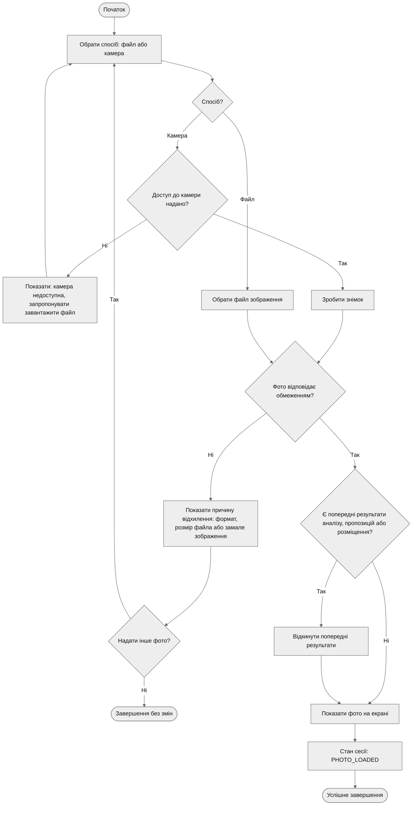

# Activity Diagram — UC-01. Завантажити фото приміщення

**Інженерне питання:** як користувач надає фото і які перевірки та альтернативи є до переходу до аналізу.
**Пов'язані вимоги:** FR-01, FR-13, NFR-04, NFR-06.
**Відповідність потокам специфікації** ([use-cases.md](../docs/use-cases.md)): A1 — гілка «Так» рішення «Є попередні результати?»; A2 — гілка «Ні» рішення «Фото відповідає обмеженням?» (формат, розмір файла, розмір зображення — NFR-06); A3 — гілка «Ні» рішення «Доступ до камери надано?»; A4 — гілка «Ні» рішення «Надати інше фото?».

