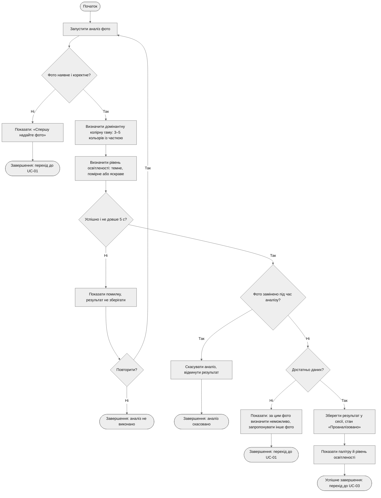

# Activity Diagram — UC-02. Проаналізувати фото приміщення

**Інженерне питання:** як проходить аналіз фото і де виникають альтернативні шляхи.
**Що видно на діаграмі:** основний успішний шлях (кроки 1–7) та потоки A1, A2, A3, E1 зі специфікації в [use-cases.md](../docs/use-cases.md).
**Пов'язані вимоги:** FR-03, FR-04, FR-05, FR-13, NFR-01, NFR-04.

Відповідність потокам: A1 — гілка «Ні» рішення «Фото наявне і коректне?»; E1 — гілка «Ні» рішення «Успішно і не довше 5 с?» із циклом «Повторити?»; A3 — гілка «Так» рішення «Фото замінено під час аналізу?»; A2 — гілка «Ні» рішення «Достатньо даних?».

