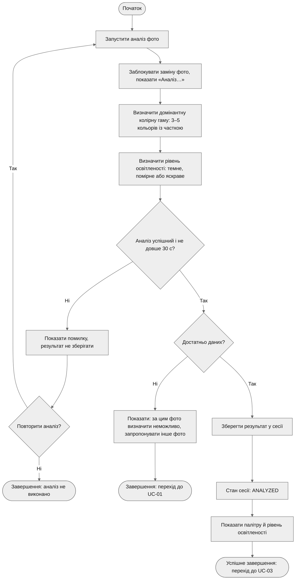

# Activity Diagram — UC-02. Проаналізувати фото приміщення

**Інженерне питання:** як проходить аналіз фото і де виникають альтернативні шляхи.
**Пов'язані вимоги:** FR-03, FR-04, FR-05, FR-13, NFR-01, NFR-04.
**Відповідність потокам специфікації** ([use-cases.md](../docs/use-cases.md)): E1 — гілка «Ні» рішення «Аналіз успішний і не довше 30 с?» із циклом «Повторити аналіз?»; A1 — гілка «Ні» рішення «Достатньо даних?». Наявність і коректність фото — передумова UC-02, тому окремо не перевіряється; заміна фото під час аналізу заблокована (FR-13).

