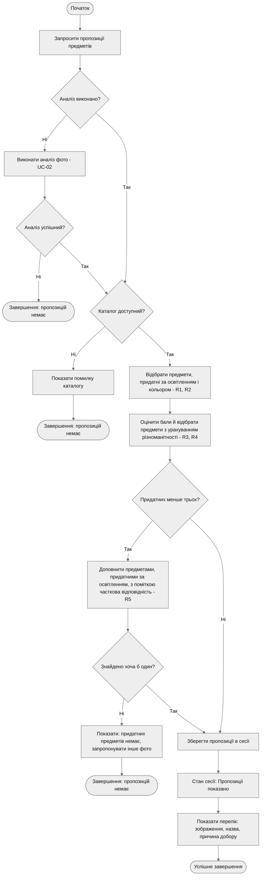

# Activity Diagram — UC-03. Отримати пропозиції предметів

**Інженерне питання:** як із результату аналізу утворюється перелік 3–4 предметів і що відбувається, коли придатних предметів мало.
**Пов'язані вимоги:** FR-06, FR-07, FR-12, NFR-05.
**Відповідність потокам специфікації** ([use-cases.md](../docs/use-cases.md)): A1 — гілка «Ні» рішення «Аналіз виконано?»; A2 — гілка «Так» рішення «Придатних менше трьох?»; E1 — гілка «Ні» рішення «Каталог доступний?».

