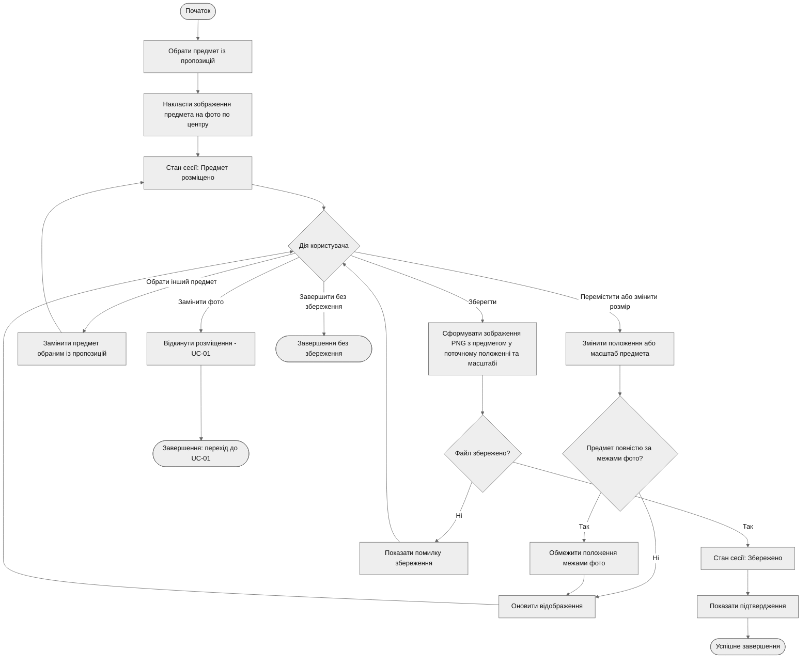

# Activity Diagram — UC-04. Розмістити предмет на фото й зберегти результат

**Інженерне питання:** як обраний предмет накладається на фото, коригується й зберігається, і які дії доступні користувачу на кожному кроці.
**Пов'язані вимоги:** FR-08, FR-09, FR-10, FR-11, FR-13, NFR-02.
**Відповідність потокам специфікації** ([use-cases.md](../docs/use-cases.md)): A1 — гілка «Обрати інший предмет»; A2 — рішення «Предмет повністю за межами фото?»; A3 — гілка «Замінити фото»; A4 — гілка «Завершити без збереження»; E1 — гілка «Ні» рішення «Файл збережено?».

